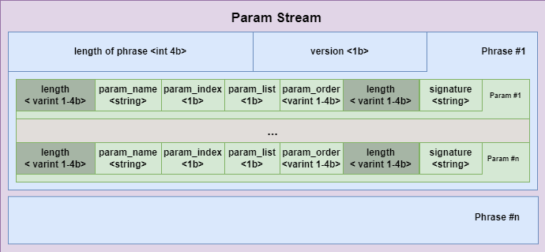
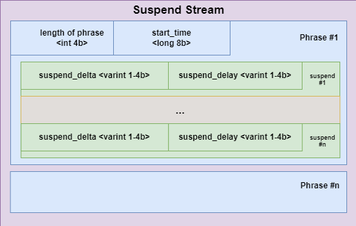
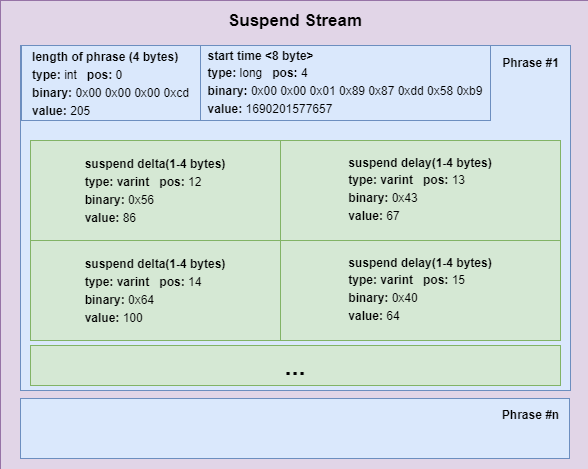
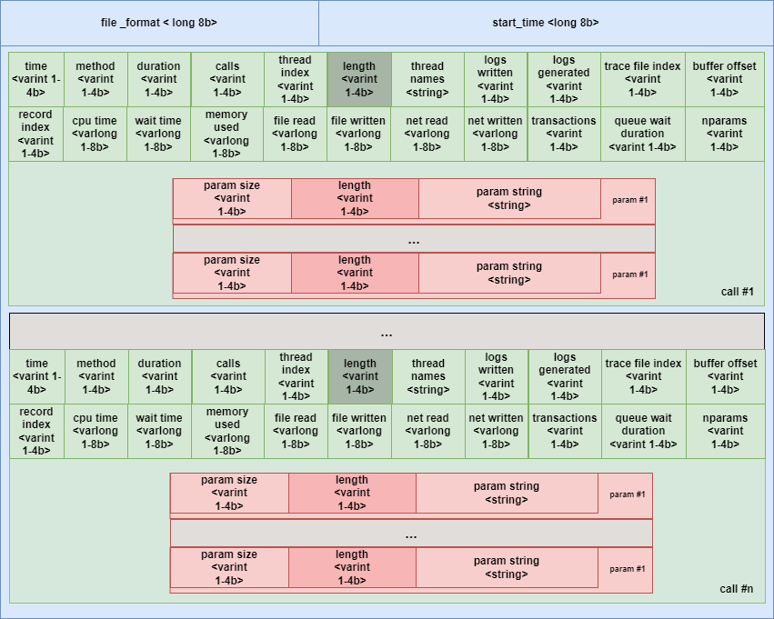
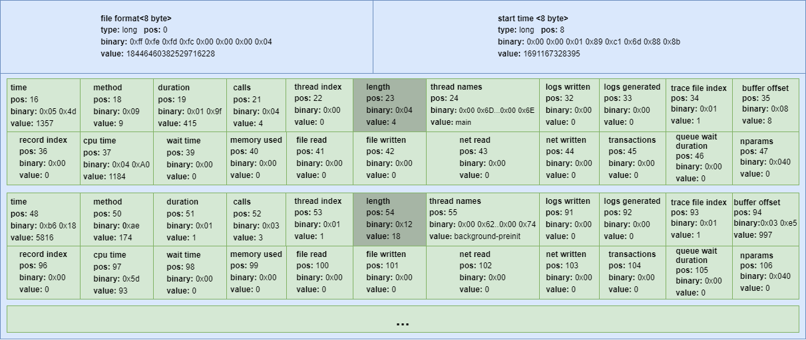
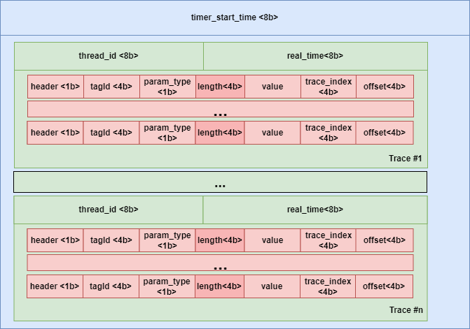

This document provide information about profiler agent

# Table of Content

<!-- TOC -->
* [Table of Content](#table-of-content)
* [Introduction](#introduction)
* [Implementation](#implementation)
* [Protocols](#protocols)
  * [TCP](#tcp)
    * [Parameters](#parameters)
    * [Connection](#connection)
    * [Flow Diagram](#flow-diagram)
    * [Binary Protocol Header](#binary-protocol-header)
      * [Fields](#fields)
      * [Commands](#commands)
        * [COMMAND_INIT_STREAM](#command_init_stream)
        * [COMMAND_INIT_STREAM_V2](#command_init_stream_v2)
        * [COMMAND_RCV_DATA](#command_rcv_data)
        * [COMMAND_CLOSE](#command_close)
        * [COMMAND_GET_PROTOCOL_VERSION (Deprecated)](#command_get_protocol_version-deprecated)
        * [COMMAND_GET_PROTOCOL_VERSION_V2](#command_get_protocol_version_v2)
        * [COMMAND_REQUEST_ACK_FLUSH](#command_request_ack_flush)
        * [COMMAND_REPORT_COMMAND_RESULT (Deprecated)](#command_report_command_result-deprecated)
        * [sendCommands(bool)](#sendcommandsbool)
  * [HTTP](#http)
* [Data Structure](#data-structure)
  * [Binary Data Format](#binary-data-format)
    * [Major Data Structures](#major-data-structures)
      * [Data Structure Visualization](#data-structure-visualization)
    * [General Structure](#general-structure)
    * [Dictionary](#dictionary)
      * [Binary description of Dictionary](#binary-description-of-dictionary)
      * [Example of Binary file for Dictionary](#example-of-binary-file-for-dictionary)
      * [Extracted Dictionary value](#extracted-dictionary-value)
    * [Param](#param)
      * [Binary Representation of Param](#binary-representation-of-param)
      * [Example of Binary file for Param](#example-of-binary-file-for-param)
      * [Extracted Param value](#extracted-param-value)
    * [Suspend](#suspend)
      * [Binary Representation of Suspend](#binary-representation-of-suspend)
      * [Example of Binary file for Suspend](#example-of-binary-file-for-suspend)
      * [Extracted Suspend value](#extracted-suspend-value)
    * [Call](#call)
      * [Binary Representation of Call](#binary-representation-of-call)
      * [Example of Binary file for Call](#example-of-binary-file-for-call)
    * [Trace](#trace)
      * [Binary Representation of Trace](#binary-representation-of-trace)
      * [Example of Binary file for Trace](#example-of-binary-file-for-trace)
      * [Extracted Trace value](#extracted-trace-value)
    * [SQL](#sql)
      * [Binary Representation of Trace](#binary-representation-of-trace-1)
      * [Example of Binary file for Trace](#example-of-binary-file-for-trace-1)
      * [Extracted Trace value](#extracted-trace-value-1)
    * [XML](#xml)
      * [Binary Representation of Trace](#binary-representation-of-trace-2)
      * [Example of Binary file for Trace](#example-of-binary-file-for-trace-2)
      * [Extracted Trace value](#extracted-trace-value-2)
  * [Text Data Format](#text-data-format)
<!-- TOC -->

# Introduction

A profiler agent is a Java-based monitoring tool that attaches to a running Java application as a Java agent. It
collects performance metrics such as CPU usage, memory allocation, thread activity and method execution times. The
agent briefly stores this data in memory (cache) and then transmits it for further analysis or storage. Profiler agents
are commonly used for real-time performance monitoring, diagnostics and identifying bottlenecks in Java applications
with minimal impact on application performance.

**Position within System Architecture**


**Data Collected**

**Top Dumps**

* Text-based CPU usage snapshots
* Captured once per minute

**Thread Dumps**

* Text files showing thread activity and states
* Captured once per minute

**Heap Dumps**

* Captured when an `OutOfMemoryError` occurs specifically on the JVM side
* Archived as ZIP files

**Performance Metrics**

* Includes dictionaries, method calls and traces
* Captured continuously for profiling and analysis

**Protocols Used**

**HTTP (Text-Based Protocol)**

* Used to transmit Top and Thread dumps as plain text
* Heap dumps are sent as ZIP archives over HTTP during error conditions

**TCP (Binary Protocol)**

* Used for transmitting structured performance data (dictionaries, calls, traces)
* Data is sent at a **5-minute granularity** for efficient, real-time analysis

# Implementation

The Profiler Agent uses different network protocols to transmit various types of data. It sends structured performance
data (such as traces and metrics) over TCP using a binary protocol, while HTTP is used to transmit text-based data like
Top dumps, Thread dumps, and Heap dumps.

# Protocols

## TCP

The Profiler Agent uses the TCP protocol to transmit binary data such as dictionaries, calls, and traces. It reads data
from a Java socket and may block while waiting for the next bytes from the client. The protocol is bidirectional,
utilizing both the InputStream and OutputStream of the socket for communication between the agent and the server.

### Parameters

The following environment parameters used during the communication

| Parameter Name               | Default value | Description                       |
|------------------------------|---------------|-----------------------------------|
| PLAIN_SOCKET_READ_TIMEOUT    | 30 s          | Read Timeout value in seconds     |
| DATA_BUFFER_SIZE             | 1 kb          | BufferedOutputStream, etc.        |
| PLAIN_SOCKET_RCV_BUFFER_SIZE | 8 kb          | Buffer size of receiving the data |
| PLAIN_SOCKET_SND_BUFFER_SIZE | 8 kb          | Buffer size of sending the data   |

### Connection

Before initiating any new connection and after each command, the Profiler Agent flushes the output stream to ensure that
any buffered output bytes are immediately written to the socket. This guarantees timely delivery of data and proper
synchronization between the agent and the server.

Data transmission and reception should occur in chunks, with the chunk size not exceeding the limits defined by the
environment variables:

* PLAIN_SOCKET_RCV_BUFFER_SIZE (for receive buffer)
* PLAIN_SOCKET_SND_BUFFER_SIZE (for send buffer)

These restrictions ensure efficient socket communication and help prevent buffer overflows or excessive memory usage.

### Flow Diagram

```plantuml
@startuml
autoactivate on
autonumber

participant "Collector"  as collector
participant "Agent"      as agent
participant "Database"   as db

collector -> collector: listen to **:1715** port
note right: execute cron

agent -> collector: connect to port
return flush output stream
note right: create and save new **ProfilerAgentConnection**, \n check for gzip header \n ready for first command (init stream)

loop for each command
    agent -> collector: send command id

    alt if command_id == COMMAND_INIT_STREAM
        note right: check against known command ids
        agent -> collector: mark it as deleted
        note right: prepare this stream_registry to delete
    else if command_id == COMMAND_GET_PROTOCOL_VERSION (Deprecated)
    else if command_id == COMMAND_GET_PROTOCOL_VERSION_V2
        alt if Namespace: Blacklisted 
            collector -> agent: Blacklisted Namespace
            note left: Flush the Output Stream.\nClose the socket with reason
        end
    else if command_id == COMMAND_REQUEST_ACK_FLUSH
    else if command_id == COMMAND_REPORT_COMMAND_RESULT
    else if command_id == COMMAND_INIT_STREAM_V2
    else if command_id == COMMAND_RCV_DATA
    else if command_id == COMMAND_CLOSE
    else invalid command
        collector -> agent: break connection
    end

end

@enduml
```

### Binary Protocol Header

Header is a sequence of bytes at the beginning of a binary data stream that provides information about the data that
follows.

#### Fields

The first byte, often denoted as 0x00, is commonly used to represent the command ID.

| Field Type | Short | Description                                          |
|------------|-------|------------------------------------------------------|
| field      | *[F]* | *[4 bytes]*`length` + *[length bytes]*`val`          |
| string     | *[S]* | *[4 bytes]*`length` + *[length bytes]*`val`          |
| long       | *[L]* | *[8 bytes]*`val`                                     |
| int        | *[I]* | *[4 bytes]*`val`                                     |
| uuid       | *[U]* | *[8 bytes]*`mostSigBits` + *[8 bytes]*`leastSigBits` |

#### Commands

The table below describes the different values of the First Byte and their corresponding commands.

| Value  | Command ID                      | Description                                    |
|--------|---------------------------------|------------------------------------------------|
| `-1`   |                                 | EOF                                            |
| `0x01` | COMMAND_INIT_STREAM             | pod sends the pod info                         |
| `0x15` | COMMAND_INIT_STREAM_V2          | pod sends the incoming stream info             |
| `0x02` | COMMAND_RCV_DATA                | pod sends a data chunk for stream              |
| `0x04` | COMMAND_CLOSE                   | pod wants to close the connection              |
| `0x08` | COMMAND_GET_PROTOCOL_VERSION    | pod asks for collector's  protocol version     |
| `0x14` | COMMAND_GET_PROTOCOL_VERSION_V2 | pod sends client info and its protocol version |
| `0x11` | COMMAND_REQUEST_ACK_FLUSH       | pod asks for commands from UI/collector        |
| `0x13` | COMMAND_REPORT_COMMAND_RESULT   | pod sends the command result                   |

##### COMMAND_INIT_STREAM

This commands to send the pod related information

| n | direction | type    | field              | description |
|---|-----------|---------|--------------------|-------------|
| 1 | from      |  string | `namespaceName`    |             |
| 2 | from      |  string | `microserviceName` |             |
| 3 | from      |  string | `podName`          |             |

##### COMMAND_INIT_STREAM_V2

This commands to send following information, it registered the stream and generates a unique `UUID` which is used for
further communication of subsequent commands.

* Pod sends the incoming stream info
* Collector closes prev stream if opened

| n  | direction | type   | field                        | description                          |
|----|-----------|--------|------------------------------|--------------------------------------|
| 1  | from      | string | `streamName`                 |                                      |
| 2  | from      | int    | `requestedRollingSequenceId` |                                      |
| 3  | from      | int    | `resetRequired`              | `>0` if should delete old dictionary |
| A4 | to        | uuid   | `null`                       | send `null` in case of exception     |
| A5 | to        | flush  |                              |                                      |
| B4 | to        | uuid   | `handleId`                   | new uuid                             |
| B5 | to        | long   | `rotationPeriod`             | see below                            |
| B6 | to        | long   | `requiredRotationSize`       | see below                            |
| B7 | to        | int    | `rollingSequenceId`          |                                      |
| B8 | to        | flush  |                              |                                      |

Details about fields:

> **rotationPeriod**
>
> `0` If stream is not required to rotation for stream (dictionary, params)
>
> Otherwise, rotate at least 3 times during retention period (or every hour).
> Use `STREAM_ROTATION_PERIOD` with priority, if defined.

and:

> **requiredRotationSize**
>
> `0` If stream is not required to rotation for stream (dictionary, params)
>
> Otherwise, rotate at least `10` times during retention period (or every `2 MB`)

##### COMMAND_RCV_DATA

This command used for following action:

* Verify the UUID
* Start receiving the stream bytes
* `call sendCommands(false)`

| n  | direction | type  | field                     | description                        |
|----|-----------|-------|---------------------------|------------------------------------|
| 1  | from      | uuid  | `handleId`                |                                    |
| 2  | from      | field | `contentLength` + `data`  |                                    |
| A3 | to        | byte  | `ACK_ERROR_MAGIC` (`-1`)  | in case of exception, close socket |

##### COMMAND_CLOSE

This command use to close the connection.

##### COMMAND_GET_PROTOCOL_VERSION (Deprecated)

| n | direction | type   | field              | description |
|---|-----------|--------|--------------------|-------------|
| 1 | to        | long   | `PROTOCOL_VERSION` | `100505L`   |
| 2 | to        | flush  |                    |             |

##### COMMAND_GET_PROTOCOL_VERSION_V2

This command is to set the following details at pod level

| n | direction | type   | field                   | description |
|---|-----------|--------|-------------------------|-------------|
| 1 | from      | long   | `clientProtocolVersion` |             |
| 2 | from      | string | `podName`               |             |
| 3 | from      | string | `microserviceName`      |             |
| 4 | from      | string | `namespaceName`         |             |
| 5 | to        | long   | `PROTOCOL_VERSION_V2`   | `100605L`   |
| 6 | to        | flush  |                         |             |

**Blacklisted Namespace**

Enable a feature to define blacklisted namespaces `(a comma ',' separated list)` to restrict the collector for storing
dumps from specified namespaces.

##### COMMAND_REQUEST_ACK_FLUSH

This command used for following:

* update active time for pod (`touchPod`)
* `call sendCommands(true)` (see below) at the end

| n | direction | type   | field              | description |
|---|-----------|--------|--------------------|-------------|
| 1 | to        | flush  |                    |             |

##### COMMAND_REPORT_COMMAND_RESULT (Deprecated)

| n | direction | type  | field               | description |
|---|-----------|-------|---------------------|-------------|
| 1 | from      | uuid  | `executedCommandId` |             |
| 1 | from      | byte  | `success`           |             |

* save command result to DB

##### sendCommands(bool)

> **Disabled now!**
>
> Don't query DB, always send `0` instead of `commands.size()`

| n  | direction | type   | field             | description                                       |
|----|-----------|--------|-------------------|---------------------------------------------------|
|    | [DB]      |        | `queryCommands()` | retrieve waiting commands from (**disabled**)     |
| 1  | to        | byte   | `commands.size()` | (should be less `100`)  (**disabled**: sends `0`) |
| 2  | to        | flush  |                   | flush socket if `sendCommands(true)`              |
| N1 | to        | uuid   | `commandId`       |                                                   |
| N2 | to        | string | `command`         |                                                   |

> So after each `COMMAND_RCV_DATA` and `COMMAND_REQUEST_ACK_FLUSH` the agent should get `0` as ack from collectors
> before any other responses

## HTTP

<!--TBD-->

# Data Structure

This Section describes the representation of data structures used to store profiler data.
These data structures are utilized across all Java-related components of the profiler, including the agent, collector
service and UI service.

## Binary Data Format

This section provides information about the **binary representation of data structures** used to store profiler data.

### Major Data Structures

The following are the primary data structures used:

| Name       | Description                                                                                                                                                                                                                                                                                                                                                                                                                        |
|------------|------------------------------------------------------------------------------------------------------------------------------------------------------------------------------------------------------------------------------------------------------------------------------------------------------------------------------------------------------------------------------------------------------------------------------------|
| Dictionary | A Dictionary is a structured collection of key-value pairs where: <br/>* The key is typically an implicit numeric identifier (often based on the position of the value in the stream).<br/>* The value is a string, stored in a binary-encoded format.<br/>* It is primarily used to avoid repeated string values in binary streams by allowing references to numeric IDs, thereby optimizing storage and transmission efficiency. |
| Suspend    | Suspend is used in profiling systems to represent pauses or inactive intervals in thread or application execution.<br/>It typically captures periods when:<br/>* A thread is waiting, sleeping, or blocked.<br/>* The profiler intentionally omits data collection to reduce overhead.<br/>* The system needs to represent a gap or delay in a trace.                                                                              |
| Param      | Param is used in profiling systems to represent a method parameter or attribute passed during execution, stored in a compact, serialized format.<br/>It captures contextual data such as values passed to methods, configuration flags, or custom tags during the profiling session.                                                                                                                                               |
| Call       | Call is used in profiling systems to represent a method invocation or function call during program execution.<br/>It captures detailed runtime behavior of an application by recording who called what, when, and with what context.                                                                                                                                                                                               |
| Trace      | Trace is used in profiling systems to represent a complete method execution path, typically capturing a sequence of method calls (entries/exits) on a specific thread over a defined time interval.<br/>It aggregates detailed runtime data like call stacks, parameters, execution time, and offsets—providing a full picture of what the application did during a profiling window.                                              |
| SQL        | A Sql is used to store the actual Database queries                                                                                                                                                                                                                                                                                                                                                                                 |
| XML        | A Xml is used to store the bind variable used to pass while running Database queries                                                                                                                                                                                                                                                                                                                                               |

#### Data Structure Visualization


### General Structure

Data structures are typically composed as **streams of typed values**, using the following data types:

| Type                   | Description                                                                                             | Size                       |
|------------------------|---------------------------------------------------------------------------------------------------------|----------------------------|
| `byte`                 | Basic byte                                                                                              | 1 byte                     |
| `bool`                 | Boolean value                                                                                           | 1 byte                     |
| `int`                  | Integer                                                                                                 | 4 bytes                    |
| `long`                 | Long integer                                                                                            | 8 bytes                    |
| `uuid`                 | Universally unique identifier                                                                           | 16 bytes                   |
| `varint`               | Variable-length integer                                                                                 | 1–4 bytes (based on value) |
| `string` / `varstring` | Variable-length string: a `varint` length <br>followed by `2 × length` bytes (each character = 2 bytes) | `varint` + 2×length bytes  |

> Note:
>
>* The **raw streams** for `Dictionary`, `Param`, and `Suspend` are divided into blocks called **phrases**.
>
>> Note: These phrases are used solely for transfer purposes and have no semantic meaning.<br>
>
>* **Timestamps** are represented in **UTC** as **Unix time** using a `long` (8 bytes).

### Dictionary

#### Binary description of Dictionary


The `Dictionary` consists of key-value pairs, where the position of each value in the binary file is treated as the key
(id) and the value itself is a string. This mapping allows efficient reference to frequently used strings using compact
numeric identifiers.

#### Example of Binary file for Dictionary


#### Extracted Dictionary value

| Id | Offset | Dictionary value             | Phrase |
|----|--------|------------------------------|--------|
| 0  | 4      | call.info                    | 1      |
| 1  | 24     | call.red                     | 1      |
| .. | ...    | ........                     |
| 94 | 10138  | java.lang.String com.......  | 2      |
| 95 | 10494  | com.netcracker.profiler .... | 2      |

* `Id` will be used later (in `calls` and `traces`) instead of actual string
* `Offset`: It in bytes from the beginning of stream/file _(for illustration purposes only)_
* `Dictionary value`: Actual captured string from the CDT agent
* `Phrase`: Number of block from incoming stream/file  _(for illustration purposes only)_

### Param

#### Binary Representation of Param



Param consist of parameters stored in a following order:

* parameter name (`varstring`)
* is parameter indexed (`bool`)
* is parameter is enumerated (`bool`)
* parameter order (`varint`)
* signature (`varstring`)

#### Example of Binary file for Param


#### Extracted Param value

| Offset | Name                | pIndex | pList | pOrder | Signature | Phrase |
|--------|---------------------|--------|-------|--------|-----------|--------|
| 5      | exception           | false  | true  | 100    | null      | 1      |
| 29     | tmus.transaction.id | true   | true  | 100    | null      | 1      |

* `Offset`: offset in bytes from the beginning of stream/file _(for illustration purposes only)_
* `Name`: actual captured string from the CDT agent
* `pIndex`: should be that parameter be indexed by storage? _(don't used now)_
* `pList`: does this parameter has one or several values?
* `pOrder`: order to distinguish different parameters with different priority/importance
* `Signature`: additional signature if any (for parameters related to methods)
* `Phrase`: number of block from incoming stream/file  _(for illustration purposes only)_

### Suspend

#### Binary Representation of Suspend



Suspend consist of captured delays stored in a following order:

* suspend delay (`varint`): actual captured delay (in ms)
* suspend delta (`varint`): delta in ms (added to the previous _timestamp_ to get exact timestamp)

For the first record `start_time` is considered as _previous timestamp_.

#### Example of Binary file for Suspend



#### Extracted Suspend value

| Pos | Offset | Timestamp     | Delta | Delay    | Phrase |
|-----|--------|---------------|-------|----------|--------|
| 1   | 12     | 1690201577743 | 86    | 67       | 1      |
| 2   | 14     | 1690201577843 | 100   | 64       | 1      |

* `Pos`: position in stream _(for illustration purposes only)_
* `Offset`: offset in bytes from the beginning of stream/file _(for illustration purposes only)_
* `Timestamp`: Actual timestamp of delay (unix-time in UTC) _(for illustration purposes only)_
* `Delta`: Delta (in ms) from previous timestamp
* `Delay`: Actual captured delay (in ms)
* `Phrase`: number of block from incoming stream/file  _(for illustration purposes only)_

### Call

#### Binary Representation of Call

There were several formats for call representation. Right now latest one, which Cloud Profiler used, is `4`.



Call consist of parameters stored in a following order:

| Parameter         | type       | size      | file format | Description                                     |
|-------------------|------------|-----------|-------------|-------------------------------------------------|
| time              | var int    | 1-4 bytes | 1, 2, 3, 4  | Offset for timestamp                            |
| method            | var int    | 1-4 bytes | 1, 2, 3, 4  | Id of method name in dictionary                 |
| duration          | var int    | 1-4 bytes | 1, 2, 3, 4  | Duration of method (in ms)                      |
| Calls             | var int    | 1-4 bytes | 1, 2, 3, 4  | Count of internal calls                         |
| threadIndex       | var int    | 1-4 bytes | 1, 2, 3, 4  | thread id                                       |
| threadNames       | var string | variable  | 1, 2, 3, 4  | thread name (only if not already parsed before) |
| LogsWritten       | var int    | 1-4 bytes | 1, 2, 3, 4  | bytes written by method                         |
| LogsGenerated     | var int    | 1-4 bytes | 1, 2, 3, 4  | bytes generated by method                       |
| TraceFileIndex    | var int    | 1-4 bytes | 1, 2, 3, 4  | Id of trace file for the call tree              |
| BufferOffset      | var int    | 1-4 bytes | 1, 2, 3, 4  | Byte Offset in trace file for record block      |
| RecordIndex       | var int    | 1-4 bytes | 1, 2, 3, 4  | Actual record id in record block for call       |
| CpuTime           | var long   | 1-8 bytes | 2, 3, 4     | actual time for work (in ms)                    |
| WaitTime          | var long   | 1-8 bytes | 2, 3, 4     | common wait (in ms)                             |
| MemoryUsed        | var long   | 1-8 bytes | 2, 3, 4     | memory used by method (in bytes)                |
| FileRead          | var long   | 1-8 bytes | 3, 4        | disk bytes read by method                       |
| FileWritten       | var long   | 1-8 bytes | 3, 4        | disk bytes written by method                    |
| NetRead           | var long   | 1-8 bytes | 3, 4        | I/O read by method (in bytes)                   |
| NetWritten        | var long   | 1-8 bytes | 3, 4        | I/O write by method (in bytes)                  |
| Transactions      | var int    | 1-4 bytes | 4           | count of DB transactions                        |
| QueueWaitDuration | var int    | 1-4 bytes | 4           | wait in queue (in ms)                           |
| _parameters_      | _struct_   | ? bytes   | 4           | _see below_                                     |

* `parameters` are multiple chunks of parameter values:

  | Parameter     | type       | size       | format |
  |---------------|------------|------------|--------|
  | nparams       | var int    | 1-4 bytes  | 4      |
  | `paramId`     | var int    | 1-4 bytes  | 4      |
  | `paramsCount` | var int    | 1-4 bytes  | 4      |
  | `paramNValue` | varstring  | variable   | 4      |

* `nparams`: count of captured parameters for the call
* it follows by `nparams` structs:
  * `paramId`: id parameter from `params` table
  * `paramCount`: count of values for the parameter (could be `0`, `1` or greater)
  * it follows by `paramCount` of actual values:
    * `paramNValue`: N-th value of parameter as `varstring` (i.e. `varint` for length + actual data string)

#### Example of Binary file for Call



* start_time of `1691167328395` is `04.08.2023 16:42:08.395 GMT`

| time offset | ts              | human          | method | duration | calls | threadIndex | threadNames          | logsWritten | logsGenerated | traceFileIndex | bufferOffset | recordIndex | cpuTime | waitTime | memoryUsed | fileRead | fileWritten | netRead | netWritten | transactions | queueWaitDuration | nparams |
|-------------|-----------------|----------------|--------|----------|-------|-------------|----------------------|-------------|---------------|----------------|--------------|-------------|---------|----------|------------|----------|-------------|---------|------------|--------------|-------------------|---------|
| -679        | _1691167327716_ | `16:42:07.716` | 9      | 415      | 4     | 0           | `main`               | 0           | 0             | 1              | 8            | 0           | 1184    | 0        | 0          | 0        | 0           | 0       | 0          | 0            | 0                 | `map[]` |
| 2908        | _1691167330624_ | `16:42:10.624` | 174    | 1        | 3     | 1           | `background-preinit` | 0           | 0             | 1              | 997          | 0           | 93      | 0        | 0          | 0        | 0           | 0       | 0          | 0            | 0                 | `map[]` |

### Trace

#### Binary Representation of Trace



A Trace consists of parameters stored in the following order:

* threadId – Identifier of the thread
* realTime – Timestamp representing the actual time of the trace

This is followed by chunks of method entries, where each entry includes the following parameters in order:

* header
* tagId
* paramType
* value
* traceIndex
* offset

#### Example of Binary file for Trace


#### Extracted Trace value

| pos | thread id | real time     | level | header | etime | tag id | value                          | trace index | offset |
|-----|-----------|---------------|-------|--------|-------|--------|--------------------------------|-------------|--------|
| 24  | 1         | 1691167327716 | 0     | 180    | 34    | 9      | -                              | -           | -      |
| 27  | 1         | 1691167327716 | 1     | 180    | 2     | 35     | -                              | -           | -      |
| 30  | 1         | 1691167327716 | 2     | 0      | -     | 33     | -                              | -           | -      |
| 32  | 1         | 1691167327716 | 2     | 13     | -     | -      | -                              | -           | -      |
| 33  | 1         | 1691167327716 | 1     | 1      | -     | -      | -                              | -           | -      |
| 34  | 1         | 1691167327716 | 1     | 136    | 3     | 148    | -                              | -           | -      |
| 37  | 1         | 1691167327716 | 1     | 1      | -     | -      | -                              | -           | -      |
| 38  | 1         | 1691167327716 | 0     | 53     | -     | -      | -                              | -           | -      |
| 39  | 1         | 1691167327716 | 0     | 130    | 7     | 0      | null                           | -           | -      |
| 44  | 1         | 1691167327716 | 0     | 2      | -     | 18     | 1691167327716                  | -           | -      |
| 74  | 1         | 1691167327716 | 0     | 2      | -     | 20     | esc-ui-service-8dd5b49fd-2gr2g | -           | -      |
| 138 | 1         | 1691167327716 | 0     | 2      | -     | 21     | main                           | -           | -      |
| 150 | 1         | 1691167327716 | 0     | 2      | -     | 24     | 1184                           | -           | -      |
| 155 | 1         | 1691167327716 | 0     | 1      | -     | -      | -                              | -           | -      |

```text
threadId=1 real_time=1691167327716
header=180 etime=34 tagId=9
  | -> header=180 etime=2 tagId=35
    | -> header=0 etime= - tagId=33
    | <- header=13 etime= - tagId= -
  | <- header=1 etime= - tagId= -
  | -> header=136 etime=3 tagId=148
  | <- header=1 etime= - tagId= -
header=53 etime= - tagId= -
header=130 etime=7 tagId=0 value=null
header=2 etime= - tagId=18 value=1691167327716
header=2 etime= - tagId=20 value=esc-ui-service-8dd5b49fd-2gr2g
header=2 etime= - tagId=21 value=main
header=2 etime= - tagId=24 value=1184
header=1 etime= - tagId= -
```

### SQL

SQL represent to store the actual database (e.g. Postgres) queries which is executed during the execution of teh
function call.

#### Binary Representation of Trace

TBD

#### Example of Binary file for Trace

TBD

#### Extracted Trace value

| pos | Value                                                                                                                                                                          |
|-----|--------------------------------------------------------------------------------------------------------------------------------------------------------------------------------|
| -   | CREATE KEYSPACE IF NOT EXISTS esc WITH replication = { 'class' : 'SimpleStrategy', 'replication_factor' : 1 } AND durable_writes = true;                                       |
| -   | select pod_name, service_name, namespace, pod_info, rc_info, dc_info from pod_details                                                                                          |
| -   | select * from active_pods where active_during_hour = ?                                                                                                                         |
| -   | SELECT * FROM pod_details WHERE pod_name=? LIMIT 1                                                                                                                             |
| -   | select rolling_sequence_id, create_when, modified_when from stream_registry where modified_when >= ? and create_when <= ? and pod_name = ? and stream_name = ? allow filtering |
| -   | select * from stream_chunks where pod_name = ? and stream_name = ? and rolling_sequence_id = ?                                                                                 |

```text
CREATE KEYSPACE IF NOT EXISTS esc WITH replication = { 'class' : 'SimpleStrategy', 'replication_factor' : 1 } AND durable_writes = true;
select pod_name, service_name, namespace, pod_info, rc_info, dc_info from pod_details
select * from active_pods where active_during_hour = ?
SELECT * FROM pod_details WHERE pod_name=? LIMIT 1
select rolling_sequence_id, create_when, modified_when from stream_registry where modified_when >= ? and create_when <= ? and pod_name = ? and stream_name = ? allow filtering
select * from stream_chunks where pod_name = ? and stream_name = ? and rolling_sequence_id = ?
```

### XML

XML represent to store bind variable which is used as a parameter to pass into the actual database (e.g. Postgres)
queries which is executed during the execution of the function call.

#### Binary Representation of Trace

TBD

#### Example of Binary file for Trace

TBD

#### Extracted Trace value

| pos | Type      | Name                | Value                                         |
|-----|-----------|---------------------|-----------------------------------------------|
| -   | TIMESTAMP | active_during_hour  | 2023-07-24T12:00:00Z                          |
| -   | TIMESTAMP | modified_when       | 2023-07-24T12:13:30.505Z                      |
| -   | TIMESTAMP | create_when         | 2023-07-24T12:28:32.456Z                      |
| -   | TEXT      | pod_name            | esc-ui-service-84967fdd77-pwhw4_1690201584049 |
| -   | TEXT      | stream_name         | calls                                         |
| -   | TEXT      | pod_name            | esc-ui-service-84967fdd77-pwhw4_1690201584049 |
| -   | TEXT      | stream_name         | calls                                         |
| -   | INT       | rolling_sequence_id | 0                                             |

```text
TIMESTAMP: active_during_hour: 2023-07-24T12:00:00Z

TIMESTAMP: modified_when: 2023-07-24T12:13:30.505Z
TIMESTAMP: create_when: 2023-07-24T12:28:32.456Z
TEXT: pod_name: esc-ui-service-84967fdd77-pwhw4_1690201584049
TEXT: stream_name: calls

TEXT: pod_name: esc-ui-service-84967fdd77-pwhw4_1690201584049
TEXT: stream_name: calls
INT: rolling_sequence_id: 0

```

## Text Data Format
