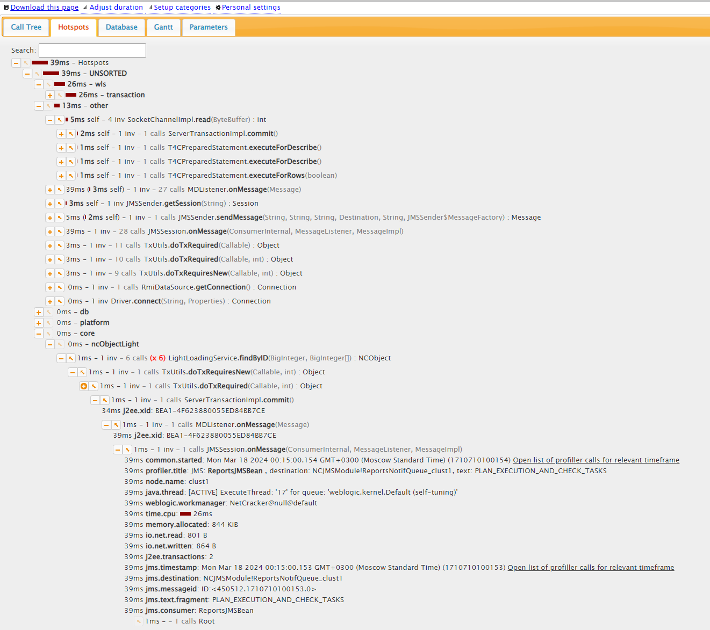
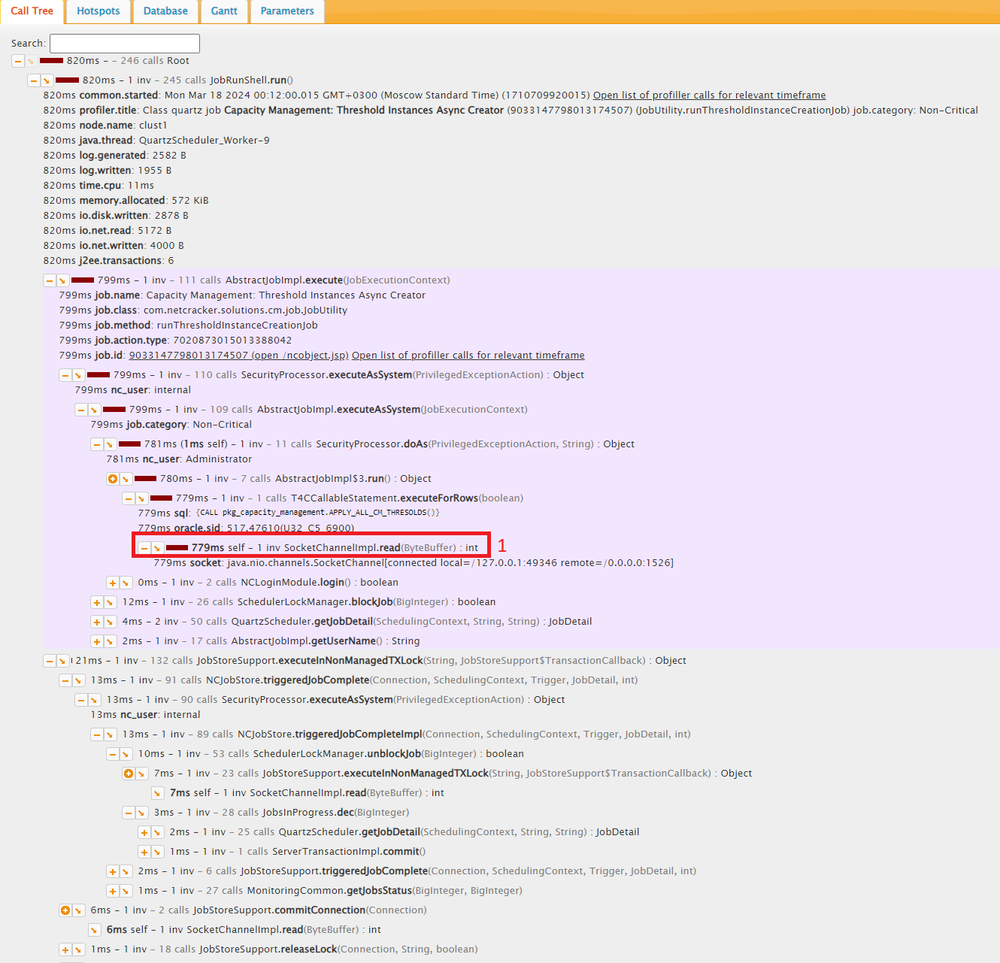
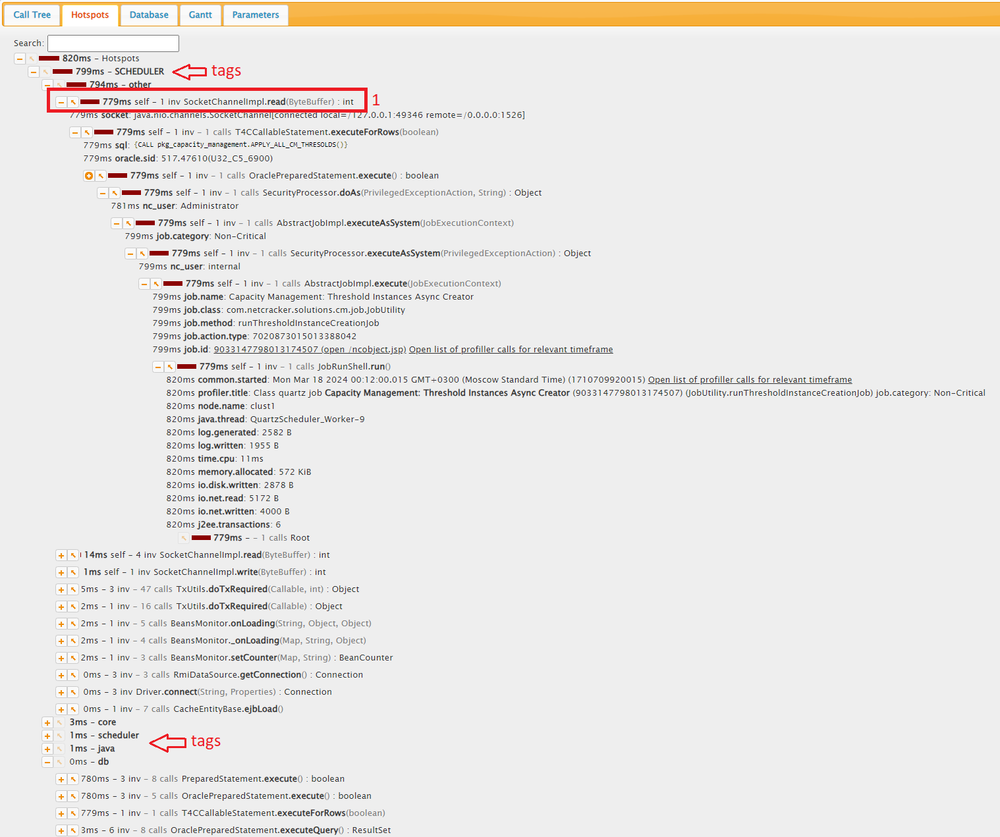
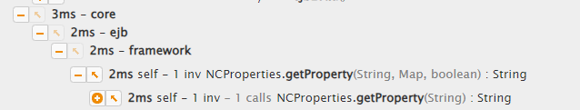

# Hotspots

## Overview

The Hot Spots view represents the tree from leaves to roots.

In this case, you can view the calls with the highest time consumption and find the root of these calls using the "+" button.

## Algorithm

There is a call-tree for example:

There is a hotspots-view for current call-tree:

The algorithm of creating hotspots view from the call-tree:

1. Looking in the call-tree for a leaf with the highest self-time value (see `1` on the pictures)
2. Analyze the `tag` of the found leaf to determine a group of branches that match the `tags` with the found leaf (all tags you can see in the section [Tags for groupping](#tags-for-groupping)).

Note that tag can have sub-tags for example:

3. Create sub-tree by sub-tags and sort the branches inside the sub-tree in descending self-time order
4. Analyze the remaining branches in the same way

### Tags for groupping

Tag is a label indicating a group of called methods.

Under these tags, calls are sorted by the self-time duration, so at the top of the page you can find the child method with the highest consumption of own time.

The default tags available in the cloud version are:

| Tag                          | Java method prefix                          |
|------------------------------|---------------------------------------------|
| logging.log4j                | org.apache.log4j                            |
| logging.commons              | org.apache.commons.logging                  |
| db                           | com.netcracker.framework.jdbc.              |
| db                           | weblogic.jdbc.wrapper.                      |
| db                           | oracle.jdbc.                                |
| db                           | org.postgresql.                             |
| profiler                     | com.netcracker.profiler.                    |
| org.quartz                   | org.quartz.                                 |
| java.reflection              | java.lang.Class                             |
| java.other                   | java.                                       |
| other                        | other                                       |

The tags which is not available in the cloud version are:

| Tag                          | Java method prefix                          |
|------------------------------|---------------------------------------------|
| core.attribute.atributeValue | com.netcracker.ejb.core.AttributeValue      |
| core.attribute.calculation   | com.netcracker.ejb.core.Calcula             |
| core.ejb.other               | com.netcracker.ejb.core.                    |
| core.ejb.framework           | com.netcracker.ejb.ramework.                |
| core.ncObjectLight           | com.netcracker.ejb.core.light.              |
| core.security                | com.netcracker.ejb.core.security.           |
| core.security                | com.netcracker.ejb.session.security.        |
| core.referenceResolver       | com.netcracker.ejb.core.ReferenceResolver   |
| core.listeners.history       | com.netcracker.ejb.core.cache.history.      |
| core.listeners.other         | com.netcracker.ejb.core.eventnotifications. |
| core.ncdo                    | com.netcracker.platform.core.ncdo.          |
| core.querybuilder            | com.netcracker.platform.core.querybuilder.  |
| core.dataaccess              | com.netcracker.platform.core.dataaccess.    |
| core.dataaccess              | com.netcracker.presentation.dataaccess.     |
| tui.other                    | com.netcracker.jsp.                         |
| tui.xml                      | com.netcracker.jsp.xml.                     |
| tui.pages                    | com.netcracker.jsp.page.                    |
| tui.cbtui                    | com.netcracker.presentation.                |
| ejb.session.common           | com.netcracker.ejb.session.common.          |
| mediation                    | com.netcracker.mediation.                   |
| orchestrator.core            | com.netcracker.platform.orchestrator.core.  |
| orchestrator.other           | com.netcracker.platform.orchestrator.       |
| solutions.dt.other           | com.netcracker.solutions.dt.                |
| solutions.dt.ngssm           | com.netcracker.solutions.dt.ngssm.          |
| ossj                         | com.netcracker.applications.ossj.           |
| solutions.telus.other        | com.netcracker.solutions.customers.telus.   |
| solutions.telus.jsp          | jsp_servlet._solutions._telus.              |
| solutions.telstra.other      | com.netcracker.solutions.telstra.           |
| solutions.telstra.jsp        | jsp_servlet._solutions._telstra.            |

The tags which need additional analyze:

| Tag                          | Java method prefix                          |
|------------------------------|---------------------------------------------|
| core.security                | com.netcracker.security.                    |
| core.dataaccess              | com.netcracker.core.request.                |
| core.other                   | com.netcracker.core.                        |
| platform.search              | com.netcracker.platform.search              |
| platform.mail                | com.netcracker.platform.mail.               |
| platform.other               | com.netcracker.platform.                    |
| scheduler                    | com.netcracker.platform.scheduler.          |
| bam                          | com.netcracker.platform.bam.                |
| solutions.other              | com.netcracker.solutions.                   |
| wls.jsp.compile              | weblogic.servlet.jsp.JavelinxJSPStub        |
| wls.transaction              | weblogic.transaction.internal.              |
| wls.wsee                     | weblogic.wsee.                              |
